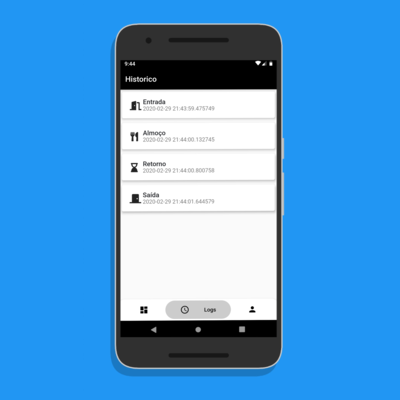

# Ponto Em Dia

Um Mockup produzido com 
- Modular (Modularização dos componentes do app e Injeção de Dependências), 
- Mobx (Gerência de Estados),
- Avatar Profile (Via Url).

## GIF

-  

## Capturas de Tela

- 
- 
- 
- 
